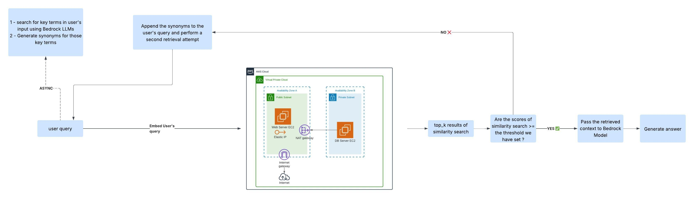

# Introduction to the project

Digico is a forward-thinking startup that provides a wide range of solutions, from AI products to robust cloud services to help customers achieve cloud transformation and AI integration.

Given the diversity of these offerings, we created **DigiBot** — an intelligent chatbot designed to help customers navigate Digico’s ecosystem. DigiBot not only introduces customers to the company, the team, and our accumulated expertise, but also guides them toward solutions that best fit their unique needs.


# Structure of the repository

```markdown1
/
│
├──RAG_pipeline
|    ├──chunking.ipynb
|    ├──embedding.ipynb
│    └──data
│       ├──chunks.json
|       ├──chunks_cleaned.json
|       └──embeddings.json
├── Scraping\_Digico\_Website/
│   ├── scraped\_data/
│   │   ├── cleaned\_text\_content.txt 
│   │   └── crawling\_raw\_output.txt 
│   └── scraping\_pipeline.ipynb   # pipeline to scrape the website
├── requirements.txt
├── README.md
├── .env.example                          # environmental variables
└── .gitignore
```


# Phase 1: Scraping the data from Digico's website

## Step 1: Scraping Digico's website

### scraping_pipeline.ipynb

This Jupyter notebook contains a complete pipeline for scraping Digico's website in order to get the most valuable information from it.  

The pipeline has the following steps:

- makes requests that appear to come from a legitimate Chrome browser  
- scrapes the page based on the sections so the text inside of each section will be agglomerated and near together to retain semantics and structure of the page  
- gets rid of anchors that retrieve redundant and repetitive information  
- gets rid of hidden elements  
- gets rid of unwanted selectors (parts that provide information with no important meaning)  
- excludes nav and footer text since they present no valuable information (but keeps links from these parts)  
- replaces Elementor counters with final values  
- extracts links from each page  
- implements a recursive crawling strategy based on the DFS algorithm for preserving semantic context  


## Step 2: Cleaning the scraped data

The file **crawling_raw_output.txt** is of the following structure:


\=== PAGE: [https://digico.solutions/ai-assessment/](https://digico.solutions/ai-assessment/) ===
\=== TEXT ===
AI Readiness Assessment Discover Your Organization’s AI Potential
Unlock ....

\=== LINKS ===
[https://digico.solutions/](https://digico.solutions/)

- `=== TEXT ===` section contains the text extracted from each page  
- `=== LINKS ===` section contains the links extracted from each page  

So we need to clean the structure to pass it to the chunking pipeline by removing:  

- page headers
- section markers
- links
- the ☁️ emoji
- add “.” to the end of each paragraph and properly handles paragraph breaks for keeping the structure : each page is contained into one paragraph (this will help with chunking in case we are using RecursiveCharacterTextSplitter) .
- skips the content of the page privacy-policy because it provides information with little importance

So in **cleaned_text_content.txt** you will only find the text information extracted from each page.  


# Phase 2: Building the RAG pipeline 

## Step 1 : Chunking

### chunking.ipynb

This jupyter notebook :

#### chunking
- takes the text content inside /Scraping_Digico_Website/scraped_data/cleaned_text_content.txt 
- chunks it using TokenTextSplitter from langchain with a chunk_size=512 & chunk_overlap=50 
-  saves the output to RAG_pipeline/data/chunks.json

#### data enriching :
- removes stopwords (while trying to keep the stopwords that make a difference in the meaning)
- removes noisy strings 
- Expands contractions (isn't -> is not, don't -> do not, etc.)
- lowercases the cleaned text
- normalizes the spaces
- saves the output to /RAG_pipeline/data/chunks_cleaned.json


## Step 2 : Embedding
### embedding.ipynb
- I used text-embedding-005 from google cloud to embed the cleaned_text field from /RAG_pipeline/data/chunks_cleaned.json and saved the embeddings vector in /RAG_pipeline/data/embeddings.json 
- I pushed the resulting embeddings with corresponsing chunk_id and original_text to Qdrant on http://localhost:6333/collections/digibot_embeddings/points


## step 3 : Implementing the Chatbot
### digibot.py

This file : 
- Leverages the capabilities of vertex ai to embed the user's query so it can be used in semantic search in order to retrieve chunks that are the most relevant to the user's input 
- Setup a connection to Qdrant (our vector database) so we can perform semantic search and retrieve a response that aligns with user's query
- Setup a DynamoDB Client so we can save the interactions history between the user and the chabtot into DynamoDB on AWS
- Setup Opik so it can be used to save the logs, traces & spans of the user-chatbot interaction in addition to customizing evaluation metrics based on our needs 

- Validates user's input to make sure that the user only enter text input that can be processed by the chabtot 
- uses bedrock models, a primary modle and a fallback model to generate responses to the user's queries
- Initializes a langchain's memory buffer to memorize the conversation and interactions between the user and the chabtot 
- Leverages prompt engineering technics to make the interaction professional, friendly and helpful
- activates the engine with langchain as a central orchestrator

#### Advanced RAG technics 

- When the user enters a query :  
    - we *asynchronously* extract the key terms from the user's query & generate synonyms for the key terms
    - we perform similarity search & return the top_k results that have the highest score 


- I have set a threshold, if no one of the top_k results has a similarity score equal or greater than the threshold we do the following :

    - we append the synonyms to the user's query & re-perform similarity search 
    - this allows us to return results for user's queries that contain key terms that aren't even avaialble in the dataset




- Note : digibot.py and digibot_with_markdown.ipynb contain the exact same code but the difference is that I used the markdown feature of the .ipynb notebooks to explain what each seciton of the code does, but to run the chatbot in the terminal it is better to run the digibot.py file


# How to use the repository

- Configure your aws credentials

```bash
aws configure
````
This will prompt you to enter :
AWS_ACCESS_KEY_ID

AWS_ACCESS_KEY_ID

DEFAULT_REGION_NAME

DEFAULT_OUTPUT_FORMAT

- SSH into your private ec2 instance :

I am using a well-know VPC architecture where we use an EC2 instance inside of the public subnet (bastion host) and another ec2 instance inside the private subnet (where our vector database is) so in order to make our work easier,  we need to ssh into the EC2 instance inside of the public subnet and then open an SSH tunnel into the EC2 instance inside of the private subnet. To do so : 

```bash
Host private_IP_private_EC2_Instance
  HostName private_IP_private_EC2_Instance
  IdentityFile key_pair_of_private_EC2_instance.pem
  User remote_login_username_private
  ProxyJump Elastic_IP_of_Public_EC2_Instance

Host Elastic_IP_of_Public_EC2_Instance
  HostName Elastic_IP_of_Public_EC2_Instance
  IdentityFile key_pair_of_public_EC2_instance.pem
  User remote_login_username_public

```


- Create a Google Cloud Vertex AI project:

  - Go to https://cloud.google.com/?hl=en  
  - Click on “Console”  
  - Create a new project  
  - After that, you need to log in to your project using the Google Cloud CLI  
  - How to install Google Cloud CLI:  
    [Install the gcloud CLI | Google Cloud SDK Documentation](https://cloud.google.com/sdk/docs/install)
  - Run `gcloud init`
  - Run `gcloud auth application-default login`


- Create a virtual environment 

```bash
python3.12 -m venv .venv
source ./.venv/bin/activate
cd DigiBot
pip install -r requirements.txt
````


- To scrape Digico's website :  open **./Scraping_Digico_Website/scraping_pipeline.ipynb** and run all the code cells.
Then open **./Scraping_Digico_Website/scraped_data/cleaned_text_content.txt** to see the cleaned result 


- To chunk the data : open **./RAG_pipeline/chunking.ipynb** and run all the cells and then open **./RAG_pipeline/data/chunks_cleaned.json** to see the cleaned chunks of data that are ready for embedding 


- To embed the chunks and push them to Qdrant : open **./RAG_pipeline/embedding.ipynb** and run all the cells and your embeddings will be saved to Qdrant

- Finally, to launch the chatbot:

```bash
cd RAG_pipeline
python3.12 digibot.py
````
And enjoy 


## License

This project is licensed under the MIT License - see the [LICENSE](LICENSE) file for details.
